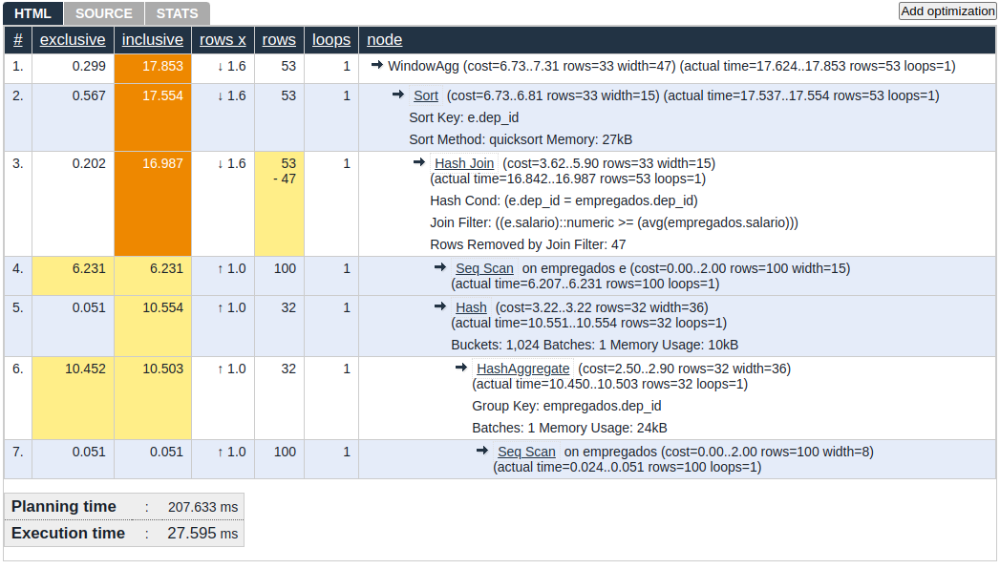
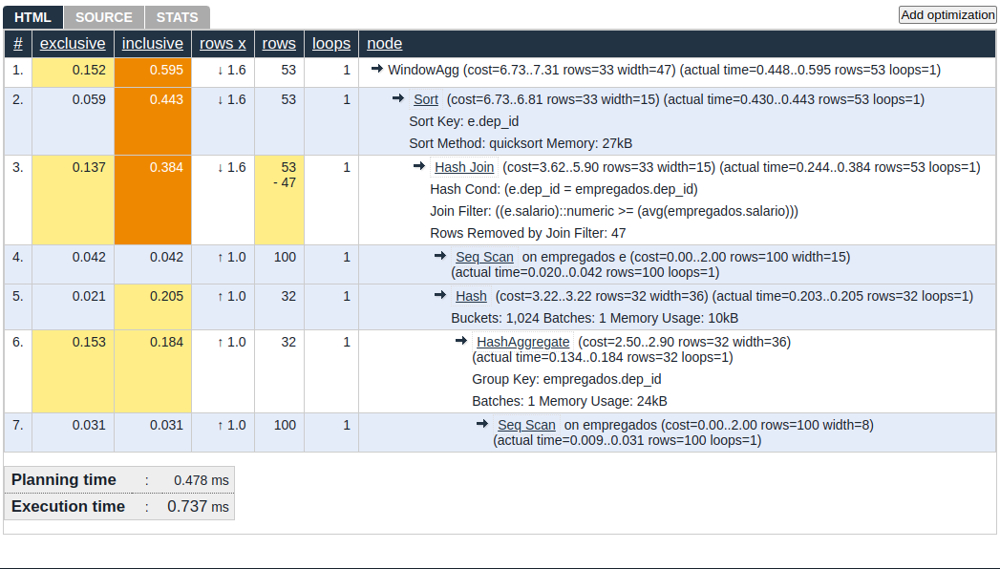

# Banco de Dados II - 2023/2

# Relatório Otimização de Queries

Aluna: Débora Rebelatto

- O que é otimização de queries?
- Porque otimizar queries?
- Como o postgres otimiza queries?
- O que é um plano de execução?
- Como ler um plano de execução?
- Como otimizar queries?
- Quais queries foram utilizadas para o relatório?
- Quais foram os resultados obtidos?
- Como foi feita a análise dos resultados?
- Quais foram as conclusões obtidas?

## Introdução

Otimizar queries é importante para que o banco de dados tenha um melhor desempenho, pois quanto mais rápido as queries são executadas, mais rápido o banco de dados responde ao usuário.

## Objetivo

Neste relatório, iremos analisar o desempenho de algumas queries e tentar otimizá-las para que elas sejam executadas mais rapidamente.

## Queries

As queries utilizadas no seguinte relatório foram feitas com base em um trabalho da disciplina de Banco de Dados II, onde o objetivo era criar um banco de dados para uma empresa fictícia e realizar consultas sobre o mesmo. E podem ser encontradas no arquivo `queries.sql` deste repositório.

## O comando EXPLAIN ANALYZE

O postgres tenta encontrar a melhor forma de otimizar uma query, no entanto, muitas vezes o problema pode se encontrar em como a query foi escrita, e não no plano de execução. Por isso, é importante analisar o plano de execução para entender o que está acontecendo e como podemos otimizar a query.

O `ANALYZE` é uma opção do comando `EXPLAIN` que nos permite executar a query e ver os resultados reais de cada nó do plano de execução, juntamente com as estimativas do planner, assim tendo valores mais confiáveis para analisar o desempenho da query.

## Resultados da primeira execução

A seguir temos os resultados da primeira execução do comando de `EXPLAIN ANALYZE` para cada uma das 10 consultas fornecidas, onde analisamos o tempo de planejamento e de execução para cada uma limpando o buffer antes para evitar que o cache do sistema influencie nos resultados.

Ordenando pelo tempo de total de forma decrescente, podemos facilitar a visualização sobre quais consultas são mais lentas para selecionar as três mais lentas para a análise de otimização.

| Query    | Tempo de Planejamento (ms) | Tempo de Execução (ms) |
| -------- | -------------------------- | ---------------------- |
| Query 10 | 52.263                     | 20.959                 |
| Query 7  | 52.424                     | 21.002                 |
| Query 8  | 52.617                     | 21.252                 |
| Query 1  | 27.843                     | 24.542                 |
| Query 4  | 60.226                     | 24.391                 |
| Query 5  | 60.297                     | 24.311                 |
| Query 6  | 118.544                    | 21.278                 |
| Query 2  | 60.442                     | 35.730                 |
| Query 9  | 85.155                     | 32.442                 |
| Query 3  | 160.001                    | 32.058                 |

Irei levar em conta apenas o tempo de execução para a análise de otimização, pois o tempo de planejamento não é algo que podemos otimizar diretamente, e sim indiretamente através da otimização da query. Então, temos que as consultas mais lentas são: 10, 7 e 8.

O resultado para a saída do comando de `EXPLAIN ANALYZE` pode ser encontrado na pasta `resultados` deste repositório.

Os cálculos para média e desvio não serão demonstrados, porém eles podem ser encontrados ao final de todas as tabelas de valores e foram obtidos a partir das seguintes fórmulas:

- Média: soma de todos os tempos dividido pelo número de execuções

  $$
  \frac{\sum_{i=1}^{n}x_i}{n}
  $$

- Desvio: raiz quadrada da soma de todos os tempos de menos a média elevado ao quadrado dividido pelo número de execuções

  $$
  \sqrt{\frac{\sum_{i=1}^{n}(x_i-\bar{x})^2}{n}}
  $$

## [Query 10](./resultados/output10.txt)

**Descrição:**

Encontre os empregados com salario maior ou igual a média do seu departamento. Deve ser reportado o salario do empregado e a média do departamento (dica: usar window function com subconsulta)

```sql
                                                                     QUERY PLAN
----------------------------------------------------------------------------------------------------------------------------------------------------
 WindowAgg  (cost=0.30..161.78 rows=3333 width=47) (actual time=24.117..42.506 rows=5096 loops=1)
   ->  Nested Loop  (cost=0.30..111.78 rows=3333 width=15) (actual time=23.424..32.881 rows=5096 loops=1)
         ->  Index Scan using idx_dep_id on empregados e  (cost=0.14..13.64 rows=100 width=15) (actual time=23.226..23.310 rows=100 loops=1)
         ->  Memoize  (cost=0.15..0.85 rows=33 width=4) (actual time=0.010..0.075 rows=51 loops=100)
               Cache Key: e.salario
               Cache Mode: binary
               Hits: 34  Misses: 66  Evictions: 0  Overflows: 0  Memory Usage: 125kB
               ->  Index Only Scan using idx_salario on empregados t  (cost=0.14..0.84 rows=33 width=4) (actual time=0.011..0.056 rows=52 loops=66)
                     Index Cond: (salario <= e.salario)
                     Heap Fetches: 3403
 Planning Time: 170.555 ms
 Execution Time: 79.573 ms
(12 rows)


```

```sql
EXPLAIN ANALYZE SELECT e.nome, e.dep_id, e.salario, AVG(e.salario)
OVER (PARTITION BY e.dep_id) AS media_salario_departamento
FROM empregados e
JOIN (SELECT dep_id, AVG(salario) AS media_salario
FROM empregados GROUP BY dep_id) AS t
ON e.dep_id = t.dep_id
WHERE e.salario >= t.media_salario;
```

EXPLAIN ANALYZE
SELECT
    e.nome,
    e.dep_id,
    e.salario,
    AVG(e.salario) OVER (PARTITION BY e.dep_id) AS media_salario_departamento
FROM
    empregados e, empregados t
WHERE
    e.salario >= t.salario;

## Tarefa 1

- [x] Executar a consulta 5 vezes, calcular a média e o desvio.
- [ ] Explicar o funcionamento com o comando explain
- [ ] Explicar o plano da consulta.
- [ ] Atentar: Qual algoritmo foi usado para realizar o Join? Explique o seu funcionamento.

## Tarefa 2

- [ ] Analisar a consulta visando possíveis melhorias na consulta.
- [ ] Qual etapa está gastando mais recursos? Será que a inserção de index pode ajudar a reduzir o tempo da consulta?
- [ ] Além disso, reescrever a consulta pode auxiliar o SBGB?


| Consulta | Planejamento (ms) | Execução (ms) |
|----------|--------------------|----------------|
| 1        | 207.633            | 27.595         |
| 2        | 0.371              | 0.735          |
| 3        | 0.440              | 1.200          |
| 4        | 0.368              | 0.665          |
| 5        | 0.478              | 0.737          |
| **Média**| **41.258**         | **6.786**      |
| **Desvio**| **82.254**        | **10.840**     |


Após a segunda execução da query, percebemos que a gradualmente o tempo de execução começa a diminuir, o que ocorre por causa da cache do sistema, que armazena os dados na memória para que eles possam ser acessados mais rapidamente.

| Linha                                                                       | Descrição                                                                                                          |
| --------------------------------------------------------------------------- | ------------------------------------------------------------------------------------------------------------------ |
| WindowAgg (cost=6.73..7.31 rows=33 width=47) (actual time=0.111..0.144)     | Realiza uma agregação em janela para calcular funções analíticas, como a média (`AVG`) com uma partição definida.  |
| Sort (cost=6.73..6.81 rows=33 width=15) (actual time=0.106..0.109)          | Classifica os resultados da consulta baseados na coluna `dep_id`.                                                  |
| Hash Join (cost=3.62..5.90 rows=33 width=15) (actual time=0.064..0.096)     | Realiza uma junção (`JOIN`) entre as tabelas `e` e `empregados` usando a condição `e.dep_id = empregados.dep_id`.  |
| Seq Scan on empregados e (cost=0.00..2.00 rows=100 width=15)                | Executa uma varredura sequencial na tabela `empregados` (alias `e`) para realizar a leitura dos dados.             |
| Hash (cost=3.22..3.22 rows=32 width=36) (actual time=0.050..0.051)          | Cria uma tabela hash para otimizar o acesso aos resultados da agregação (média salarial por departamento).         |
| HashAggregate (cost=2.50..2.90 rows=32 width=36) (actual time=0.033..0.045) | Realiza a agregação (`AVG`) agrupando os dados da tabela `empregados` por `dep_id` para calcular a média salarial. |
| Seq Scan on empregados (cost=0.00..2.00 rows=100 width=8)                   | Executa uma varredura sequencial na tabela `empregados` para realizar a leitura dos dados.                         |






Ainda assim o impacto sobre esta query não é tão grande e vemos que ela ainda é relativamente custosa para o banco de dados.

## [Query 7](./resultados/output7.txt)

Descrição:
Listar os nomes dos departamentos com o total de salários pagos (sliding windows function)

```sql
EXPLAIN ANALYZE SELECT d.dep_id, d.nome AS departamento, SUM(e.salario) AS "Salario total"
FROM departamentos d
LEFT OUTER JOIN empregados e ON d.dep_id = e.dep_id
GROUP BY d.dep_id, d.nome;
```

| Consulta | Planning Time (ms) | Execution Time (ms) |
| -------- | ------------------ | ------------------- |
| 1        | 138.035            | 46.593              |
| 2        | 0.145              | 0.241               |
| 3        | 0.121              | 0.230               |
| 4        | 0.119              | 0.242               |
| 5        | 0.120              | 0.223               |
| Média    | 27.843             | 24.542              |
| Desvio   | 85.155             | 32.442              |

## [Query 8](./resultados/output8.txt)

Descrição:
Listar os nomes dos colaboradores com salario maior que a média do seu departamento (dica: usar subconsultas);

```sql
EXPLAIN ANALYZE select emp_id,nome, dep_id, salario
from empregados e1
where salario > (select avg(salario)
from empregados e2
where e1.dep_id = e2.dep_id);
```

| Consulta | Planning Time (ms) | Execution Time (ms) |
| -------- | ------------------ | ------------------- |
| 1        | 220.741            | 16.754              |
| 2        | 0.059              | 0.963               |
| 3        | 0.058              | 0.950               |
| 5        | 0.062              | 0.974               |
| 6        | 0.095              | 1.873               |
| Média    | 44.203             | 4.3028              |
| Desvio   | 85.155             | 32.442              |

| Linha | Descrição                                                                                                                                         |
| ----- | ------------------------------------------------------------------------------------------------------------------------------------------------- |
| 1     | Realiza uma varredura sequencial na tabela 'empregados' (e1) buscando todas as linhas, resultando em 47 linhas.                                   |
| 2     | Aplica um filtro para selecionar as linhas onde o salário é maior que o valor retornado pelo SubPlano 1, removendo 53 linhas.                     |
| 3     | Subplano que calcula uma agregação na tabela 'empregados' (e2).                                                                                   |
| 4     | Retorna uma única linha de resultado após a agregação.                                                                                            |
| 5     | Faz um scan sequencial na tabela 'empregados' (e2) para calcular a média dos salários, retornando 4 linhas.                                       |
| 6     | Aplica um filtro para manter apenas as linhas onde o 'dep_id' de 'empregados' (e2) é igual ao 'dep_id' de 'empregados' (e1), removendo 96 linhas. |

Certamente, aqui está a tabela com a explicação para cada linha do plano de execução da consulta:

| Linha                                                                       | Descrição                                                                                                          |
| --------------------------------------------------------------------------- | ------------------------------------------------------------------------------------------------------------------ |
| WindowAgg (cost=6.73..7.31 rows=33 width=47) (actual time=0.111..0.144)     | Realiza uma agregação em janela para calcular funções analíticas, como a média (`AVG`) com uma partição definida.  |
| Sort (cost=6.73..6.81 rows=33 width=15) (actual time=0.106..0.109)          | Classifica os resultados da consulta baseados na coluna `dep_id`.                                                  |
| Hash Join (cost=3.62..5.90 rows=33 width=15) (actual time=0.064..0.096)     | Realiza uma junção (`JOIN`) entre as tabelas `e` e `empregados` usando a condição `e.dep_id = empregados.dep_id`.  |
| Seq Scan on empregados e (cost=0.00..2.00 rows=100 width=15)                | Executa uma varredura sequencial na tabela `empregados` (alias `e`) para realizar a leitura dos dados.             |
| Hash (cost=3.22..3.22 rows=32 width=36) (actual time=0.050..0.051)          | Cria uma tabela hash para otimizar o acesso aos resultados da agregação (média salarial por departamento).         |
| HashAggregate (cost=2.50..2.90 rows=32 width=36) (actual time=0.033..0.045) | Realiza a agregação (`AVG`) agrupando os dados da tabela `empregados` por `dep_id` para calcular a média salarial. |
| Seq Scan on empregados (cost=0.00..2.00 rows=100 width=8)                   | Executa uma varredura sequencial na tabela `empregados` para realizar a leitura dos dados.                         |

Essa tabela resume cada linha do plano de execução, destacando a operação realizada em cada etapa e quantas linhas são afetadas em cada passo da consulta.

| Linha | Tipo      | Método    | Custo        | Número de Linhas | Largura | Tempo Real   | Observações                                                                                                          |
| ----- | --------- | --------- | ------------ | ---------------- | ------- | ------------ | -------------------------------------------------------------------------------------------------------------------- |
| 1     | Seq Scan  | -         | 0.00..229.50 | 47               | 19      | 7.223..8.985 | A linha principal da consulta, lê as linhas da tabela 'empregados' utilizando um scan sequencial e aplica um filtro. |
| 2     | Filter    | -         | -            | 47 (removidas)   | -       | -            | Realiza a filtragem dos resultados da linha 1, removendo as linhas que não atendem à condição.                       |
| 3     | SubPlan 1 | Aggregate | 2.26..2.27   | 1                | 32      | 0.017..0.017 | Um subplano que calcula uma agregação.                                                                               |
| 4     | ->        | Aggregate | -            | 1                | 32      | 0.017..0.017 | Realiza a agregação retornando uma única linha de resultado.                                                         |
| 5     | ->        | Seq Scan  | 0.00..2.25   | 4                | 4       | 0.005..0.014 | Um scan sequencial na tabela 'empregados' (e2) para calcular a média.                                                |
| 6     | ->        | Filter    | -            | 96 (removidas)   | -       | -            | Filtra os resultados da linha 5, removendo as linhas que não atendem à condição do filtro.                           |

Essa tabela explica cada linha do plano de execução fornecido para a consulta em questão, detalhando o tipo de operação, o método de execução, o custo estimado, o número de linhas, a largura (width) dos dados, o tempo real de execução e observações sobre cada etapa do plano.
