# Banco de Dados II - 2023/2

# Relatório Otimização de Queries

Aluna: Débora Rebelatto

- O que é otimização de queries?
- Porque otimizar queries?
- Como o postgres otimiza queries?
- O que é um plano de execução?
- Como ler um plano de execução?
- Como otimizar queries?
- Quais queries foram utilizadas para o relatório?
- Quais foram os resultados obtidos?
- Como foi feita a análise dos resultados?
- Quais foram as conclusões obtidas?

## Introdução

Otimizar queries é importante para que o banco de dados tenha um melhor desempenho, pois quanto mais rápido as queries são executadas, mais rápido o banco de dados responde ao usuário.

## Objetivo

Neste relatório, iremos analisar o desempenho de algumas queries e tentar otimizá-las para que elas sejam executadas mais rapidamente.

## Queries

As queries utilizadas no seguinte relatório foram feitas com base em um trabalho da disciplina de Banco de Dados II, onde o objetivo era criar um banco de dados para uma empresa fictícia e realizar consultas sobre o mesmo. E podem ser encontradas no arquivo `queries.sql` deste repositório.

## EXPLAIN ANALYZE

A seguir temos os resultados da primeira execução do comando de `EXPLAIN ANALYZE` para cada uma das 10 consultas fornecidas, onde analisamos o tempo de planejamento e de execução para cada uma limpando o buffer antes para evitar que o cache do sistema influencie nos resultados.

A coluna de tempo total é a soma do tempo de planejamento e de execução.

Ordenando pelo tempo de total de forma decrescente, podemos facilitar a visualização sobre quais consultas são mais lentas, e portanto, quais consultas devem ser otimizadas.

| Query    | Tempo de Planejamento (ms) | Tempo de Execução (ms) | Tempo Total (ms) |
| -------- | -------------------------- | ---------------------- | ---------------- |
| Query 3  | 160.001                    | 32.058                 | 192.059          |
| Query 6  | 118.544                    | 21.278                 | 139.822          |
| Query 9  | 85.155                     | 32.442                 | 117.597          |
| Query 2  | 60.442                     | 35.730                 | 96.172           |
| Query 5  | 60.297                     | 24.311                 | 84.608           |
| Query 4  | 60.226                     | 24.391                 | 84.617           |
| Query 8  | 52.617                     | 21.252                 | 73.869           |
| Query 7  | 52.424                     | 21.002                 | 73.426           |
| Query 10 | 52.263                     | 20.959                 | 73.222           |
| Query 1  | 27.843                     | 24.542                 | 52.385           |

Uma análise que podemos fazer apenas a partir desses dados é que todas as consultas possuem um tempo de planejamento muito maior que o tempo de execução, o que indica que o tempo de execução não é o problema, e sim o tempo de planejamento. Isso pode ser explicado pelo fato de que o postgres precisa analisar a query e decidir qual o melhor plano de execução para a mesma, e isso leva tempo.

Com os resultados obtidos, temos que as queries que mais demoraram a ser executadas foram as queries 3, 6 e 9, e portanto, serão as consultas que serão otimizadas. Para todas as consultas analisadas foram feitas os seguinte passos como parte do processo de otimização:

- Explicar o funcionamento com o comando explain das 3 consultas mais lentas.
- Executar a consulta 5 vezes, calcular a média e o desvio.
- Explicar o plano da consulta.

O resultado para a saída do comando de `EXPLAIN ANALYZE` pode ser encontrado na pasta `resultados` deste repositório.
Os cálculos para média e desvio não serão demonstrados, porém eles podem ser encontrados ao final de todas as tabelas de valores e foram obtidos a partir das seguintes fórmulas:

- Média: soma de todos os tempos dividido pelo número de execuções

  $$
  \frac{\sum_{i=1}^{n}x_i}{n}
  $$

- Desvio: raiz quadrada da soma de todos os tempos de menos a média elevado ao quadrado dividido pelo número de execuções

  $$
  \sqrt{\frac{\sum_{i=1}^{n}(x_i-\bar{x})^2}{n}}
  $$

## [Query 3](./resultados/resultado3.txt)

## Tarefa 1

- [x] Executar a consulta 5 vezes, calcular a média e o desvio.
- [ ] Explicar o funcionamento com o comando explain
- [ ] Explicar o plano da consulta.
- [ ] Atentar: Qual algoritmo foi usado para realizar o Join? Explique o seu funcionamento.

## Tarefa 2

- [ ] Analisar a consulta visando possíveis melhorias na consulta.
- [ ] Qual etapa está gastando mais recursos? Será que a inserção de index pode ajudar a reduzir o tempo da consulta?
- [ ] Além disso, reescrever a consulta pode auxiliar o SBGB?

Descrição do problema:

Listar o dep_id, nome e o salario do funcionario com maior salario dentro de cada departamento (usar o with).

```sql
SELECT dep_id, nome, salario
FROM empregados
WHERE (dep_id,salario)
IN (SELECT dep_id, MAX(salario)
FROM empregados
GROUP BY dep_id)
```

| Consulta   | Tempo de Planejamento (ms) | Tempo de Execução (ms) | Tempo Total (ms) |
| ---------- | -------------------------- | ---------------------- | ---------------- |
| 1          | 61.952                     | 11.059                 | 73.011           |
| 2          | 0.171                      | 0.266                  | 0.437            |
| 3          | 0.151                      | 0.116                  | 0.267            |
| 4          | 0.104                      | 0.111                  | 0.215            |
| 5          | 0.104                      | 0.110                  | 0.214            |
| **Média**  | 12.696                     | 2.132                  | 14.828           |
| **Desvio** | 25.392                     | 3.889                  | 27.281           |

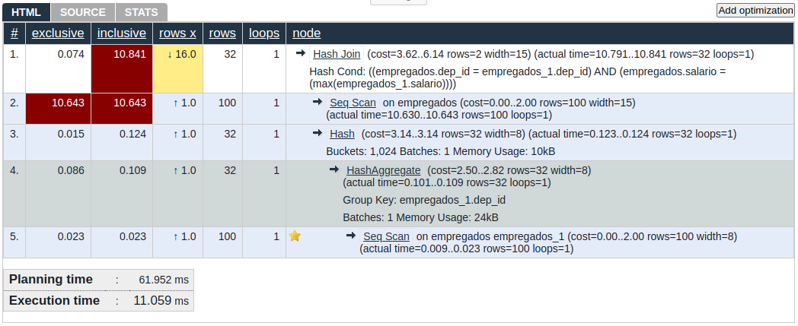
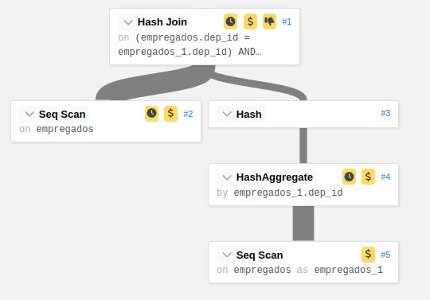
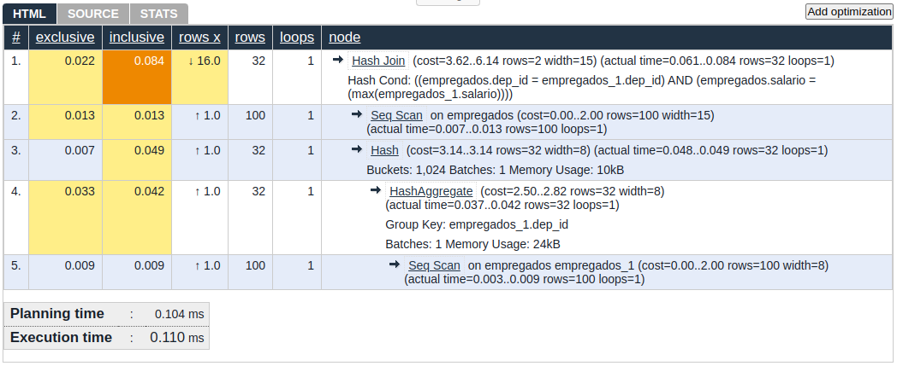
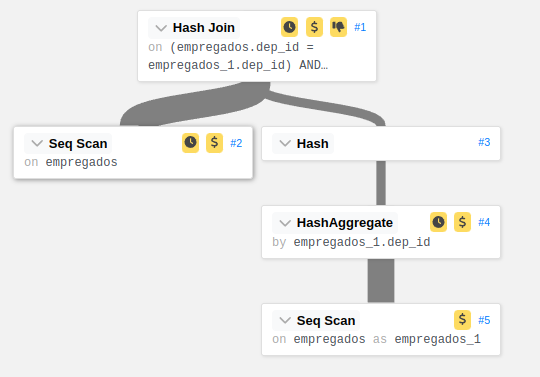

Aqui temos um resumo sobre as operações realizadas pelo postgres para executar a consulta da primeira e última execução:

**Primeira execução:**
| Tipo de Operação | Método | Número de Linhas | Tempo Real (ms) |
| ---------------- | ------ | ---------------- | --------------- |
| Hash Join | | | |
| Seq Scan | | 100 | 10.643 |
| Hash | | 32 | 0.124 |
| HashAggregate | | 32 | 0.109 |
| Seq Scan | | 100 | 0.023 |
| **Planejamento** | | | **61.952** |
| **Execução** | | | **11.059** |

**Última execução:**
| Tipo de Operação | Método | Número de Linhas | Tempo Real (ms) |
| ---------------- | ------ | ---------------- | --------------- |
| Hash Join | | | |
| Seq Scan | | 100 | 0.013 |
| Hash | | 32 | 0.049 |
| HashAggregate | | 32 | 0.042 |
| Seq Scan | | 100 | 0.009 |
| **Planejamento** | | | **0.104** |
| **Execução** | | | **0.110** |

**Explicando o plano de execução**

**Melhorando a query**

# [Query 6](./resultados/resultado6.txt)

## Tarefa 1

- [x] Executar a consulta 5 vezes, calcular a média e o desvio.
- [ ] Explicar o funcionamento com o comando explain
- [ ] Explicar o plano da consulta.
- [ ] Atentar: Qual algoritmo foi usado para realizar o Join? Explique o seu funcionamento.

## Tarefa 2

- [ ] Analisar a consulta visando possíveis melhorias na consulta.
- [ ] Qual etapa está gastando mais recursos? Será que a inserção de index pode ajudar a reduzir o tempo da consulta?
- [ ] Além disso, reescrever a consulta pode auxiliar o SBGB?

Descrição do problema:

Listar os empregados que não possue o seu chefe no mesmo departamento.

```sql
select e1.nome, e1.dep_id from empregados e1 join
empregados e2 on e1.supervisor_id=e2.emp_id
where e1.dep_id!=e2.dep_id;
```

| Consulta   | Tempo de Planejamento (ms) | Tempo de Execução (ms) | Tempo Total (ms) |
| ---------- | -------------------------- | ---------------------- | ---------------- |
| Query 1    | 161.958                    | 10.905                 | 172.863          |
| Query 2    | 0.110                      | 0.193                  | 0.303            |
| Query 3    | 0.111                      | 0.213                  | 0.324            |
| Query 4    | 0.111                      | 0.218                  | 0.329            |
| Query 5    | 0.116                      | 0.264                  | 0.380            |
| **Média**  | 32.279                     | 2.160                  | 34.439           |
| **Desvio** | 64.558                     | 3.920                  | 67.478           |

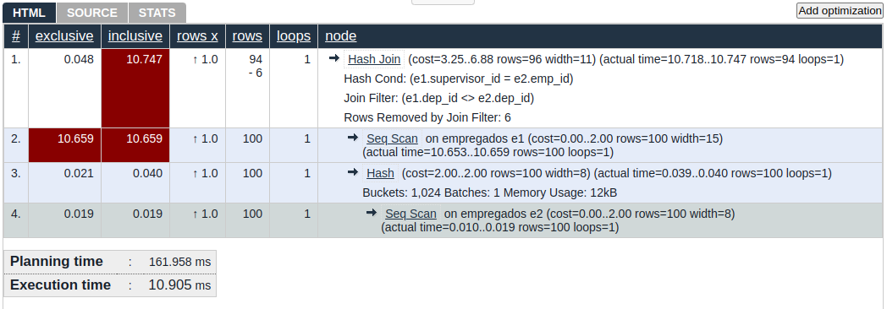

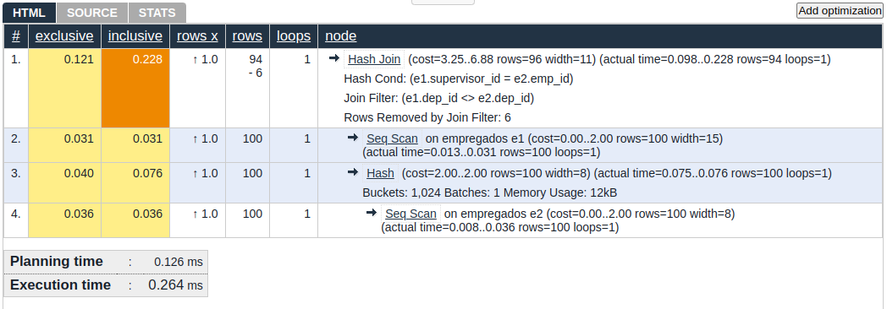
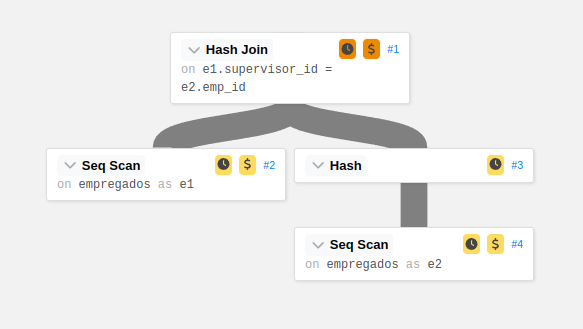

# [Query 9](./resultados/resultado9.txt)

## Tarefa 1

- [x] Executar a consulta 5 vezes, calcular a média e o desvio.
- [ ] Explicar o funcionamento com o comando explain
- [ ] Explicar o plano da consulta.
- [ ] Atentar: Qual algoritmo foi usado para realizar o Join? Explique o seu funcionamento.

## Tarefa 2

- [ ] Analisar a consulta visando possíveis melhorias na consulta.
- [ ] Qual etapa está gastando mais recursos? Será que a inserção de index pode ajudar a reduzir o tempo da consulta?
- [ ] Além disso, reescrever a consulta pode auxiliar o SBGB?

Descrição do problema:

Faça uma consulta capaz de listar os dep_id, nome, salario, e as médias de cada departamento utilizando o windows function.

```sql
SELECT emp_id, nome, dep_id, salario, AVG(salario)
OVER (PARTITION BY dep_id)
FROM empregados;
```

| Consulta   | Tempo de Planejamento (ms) | Tempo de Execução (ms) | Tempo Total (ms) |
| ---------- | -------------------------- | ---------------------- | ---------------- |
| Query 1    | 74.039                     | 43.615                 | 117.654          |
| Query 2    | 0.037                      | 0.149                  | 0.186            |
| Query 3    | 0.040                      | 0.129                  | 0.169            |
| Query 4    | 0.053                      | 0.243                  | 0.296            |
| Query 5    | 0.061                      | 0.331                  | 0.392            |
| **Média**  | 14.246                     | 8.093                  | 22.339           |
| **Desvio** | 28.492                     | 15.986                 | 44.478           |

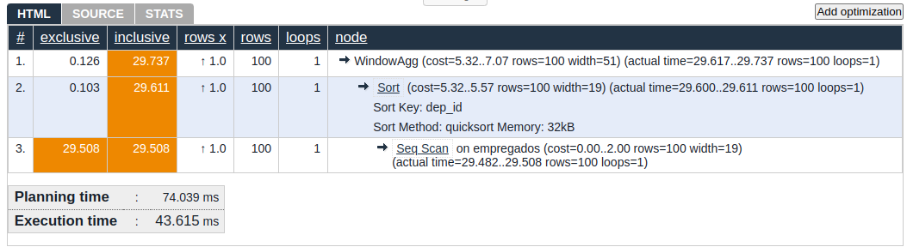
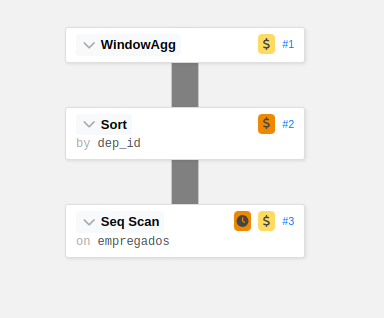
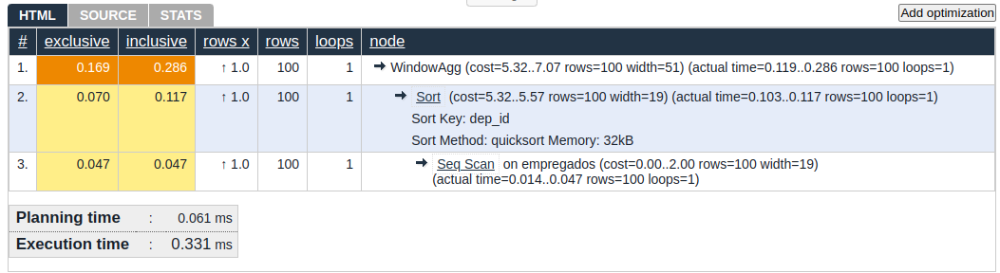
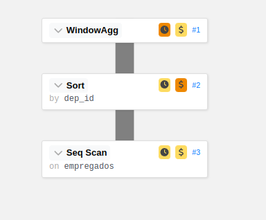
